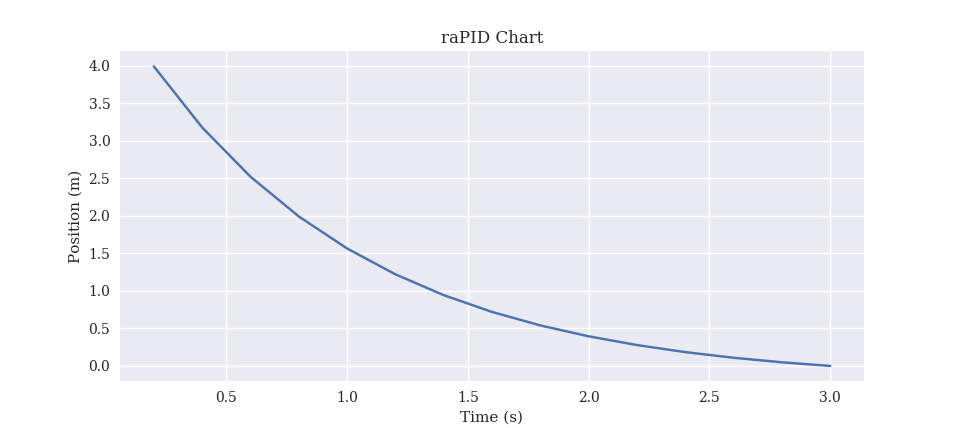

<p align="center">
  
</p>
<h3 align="center"><i>A simple Python implementation of a PID Controller</i></h3>
<p align="center">
  
  
  
  
  
  
</p>
<hr>

## ✨ In Action


<br>
<br>
<p align="center">
  
</p>

## 💻 Try it out

```sh
git clone https://github.com/safinsingh/raPID.git
conda install --file requirements.txt
python controller.py
```

> OPTIONAL: For object rendering functionality with Manim, please follow the instructions at https://github.com/ManimCommunity/manim to install manim into the `sim/manim/` directory. The NumPy, SciKit, and Pandas libraries are optional and only used for interpolation with manim.

## 👨‍💻 Authors

**Safin Singh**

## 🤝 Contributing

Contributions, PRs, issues and feature requests are welcome! Feel free to check out our [issues page](https://github.com/safinsingh/raPID/issues).

## ❤️ Show your support

Give a ⭐️ if this project helped you!
Hope you enjoy it!
